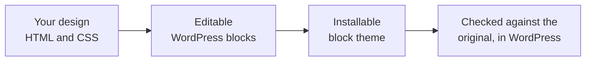
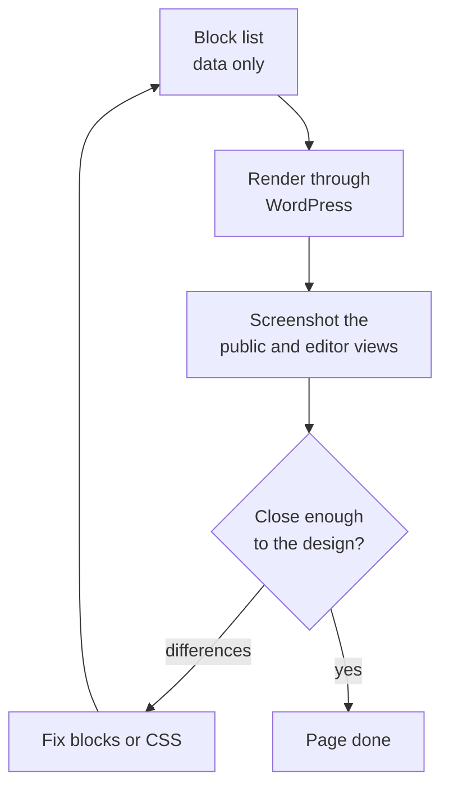

# Turning a design into an editable WordPress site

This repository takes a web page that exists as HTML and CSS and turns it into a
WordPress site you can edit in the normal WordPress editor. The result is real content and a real theme.

## A few words first

A **block** is one piece of content in WordPress: a heading, a paragraph, an
image, a button. You add and arrange blocks in the WordPress editor.

A **block theme** is a theme built entirely from blocks, plus one settings file
called `theme.json` that holds colors, fonts, and spacing. You can edit a block
theme inside WordPress without touching code.

An **agent** here means an AI coding assistant that can call tools. This
repository ships those tools (through a small server) and a set of written
instructions, called **skills**, that tell the agent how to use them.

## The problem

You have a finished design as a web page. You want it in WordPress. There are
two common ways to do this, and both have a cost.

You can paste the HTML into a single "Custom HTML" block. The page looks right,
but nobody can edit it. Changing a word means editing raw markup.

You can rebuild the page by hand in the editor. Now it is editable, but it
rarely matches the original, and the work is slow and easy to get wrong.

The goal here is to get both at once: a page that matches the design and is made
of normal, editable blocks.

## The idea

Three choices make this work.

**The original design stays the reference.** The HTML and CSS you started with
are never edited to make the output look better. They are the thing every result
is measured against.

**The WordPress version is built as data, not markup.** Instead of writing block
markup by hand, the agent writes a plain list of blocks: their names, their
settings, and what goes inside them. WordPress's own code then turns that data
into the saved markup. This matters because it guarantees the output is markup
WordPress actually produces, so the editor accepts it without complaint.

**The work is checked by comparing pictures.** After the blocks are built, the
tools render them, take a screenshot, and compare it to a screenshot of the
original design. The difference is measured. If it is too large, the agent fixes
the blocks or the CSS and checks again.

## The stages

The work happens in stages. Each stage is a skill: a written procedure the agent
follows, backed by tools that do the exact, repeatable parts.

### Stage 1 — HTML to blocks

This stage produces editable block content for each page.

The agent starts a workspace and brings in the design, either one it generates
from a brief or an existing HTML export. A tool reads the markup and lists every
section, link, and form. The agent then writes the block list for the page and
runs one build step.

That build step does five things in a row: it turns the data into block markup,
renders it the way the public site would, renders it the way the editor would,
screenshots both, and measures how far each is from the original. It returns one
report with the numbers and a list of the specific places that drift.

The agent reads the report, makes one pass of fixes, and builds again. The
target is simple: the rendered page and the editor view must each be within
about one percent of the original, with section heights off by no more than a
few pixels. When a page reaches that, it is done. When it plateaus short of it,
the run records the page as blocked and reports the real numbers instead of
claiming success.

A rule runs through this stage: use real WordPress blocks first. A menu is the
menu block. A search field is the search block. A heading is a heading block.
Custom blocks are written only for things WordPress has no block for, such as a
contact form that must save a real form. The point is that the output stays
something a person can edit, not a pile of one-off markup.

### Stage 2 — Content modeling (when the design has data)

Some pages are really lists of records: products, team members, journal posts.
A grid of six products is six of the same shape with different content.

For these, the agent describes the record once: its fields, and a few example
entries. A tool checks that description and builds a small plugin that registers
the record type in WordPress and can load the examples. The repeating section on
the page is marked as a placeholder that points at this record type.

Later, the placeholder can be swapped for a live query, so the page shows real
entries from WordPress and an editor manages them in the admin screens. When the
records carry plain fields, this swap is clean. When each record carries
something unusual, such as a unique illustration, the section is better left as
designed content, while the record type stays available for the site owner to
manage entries in the admin.

### Stage 3 — Blocks to theme

The last stage turns the finished pages into one installable theme.

Tools read the pages and gather the evidence: which colors, fonts, and spacing
values repeat, and which sections are identical across every page. Repeated
sections, like a header and footer that appear on each page, become shared parts
so they are defined once. Fonts that loaded from the web are downloaded into the
theme so it has no outside dependencies. The agent writes a plan, and a tool
assembles the theme from it: the settings file, the templates, the shared parts,
and the pages packaged so WordPress can import them.

Then the theme is checked twice. A static check confirms the files are valid. A
live check boots a real, temporary WordPress, installs the theme,
imports the pages, screenshots each one, and compares it to the original design
again. It also confirms WordPress reads every block back as valid. Only when both
checks pass on every page is the theme finished.

## Which imports this fits

The same pipeline covers several starting points.

**A design you already have.** Hand it an HTML and CSS export and it produces an
editable, installable theme that matches it.

**A multi-page site.** It detects sibling pages, builds one page fully to settle
the shared header, footer, and styles, then builds the rest against that
foundation. The shared parts are found by comparing pages, not assumed.

**A site with real data.** When a design implies products or posts, it can model
that data as a proper WordPress record type, so the site owner edits entries in
the admin instead of in raw page content.

**A design you are still making.** It can generate the source page from a brief
first, then run the same steps.

## Why this is worth it

Nothing is taken on trust. Every claim that the result matches is a measured
number against the original, taken inside real WordPress, not a guess.

The output is editable. Because it is built from standard blocks and verified the
way the editor verifies, the person who inherits the site can change it without
fear of breaking it.

The output stands alone. Fonts and assets are bundled, links are rewritten to
real pages, and the theme installs without reaching out to anything.

And the slow, error-prone middle, translating a design into blocks and proving it
matches, is handled by tools that do it the same way every time. A person sets
the direction and judges the result. The repeating work is measured, not guessed.
